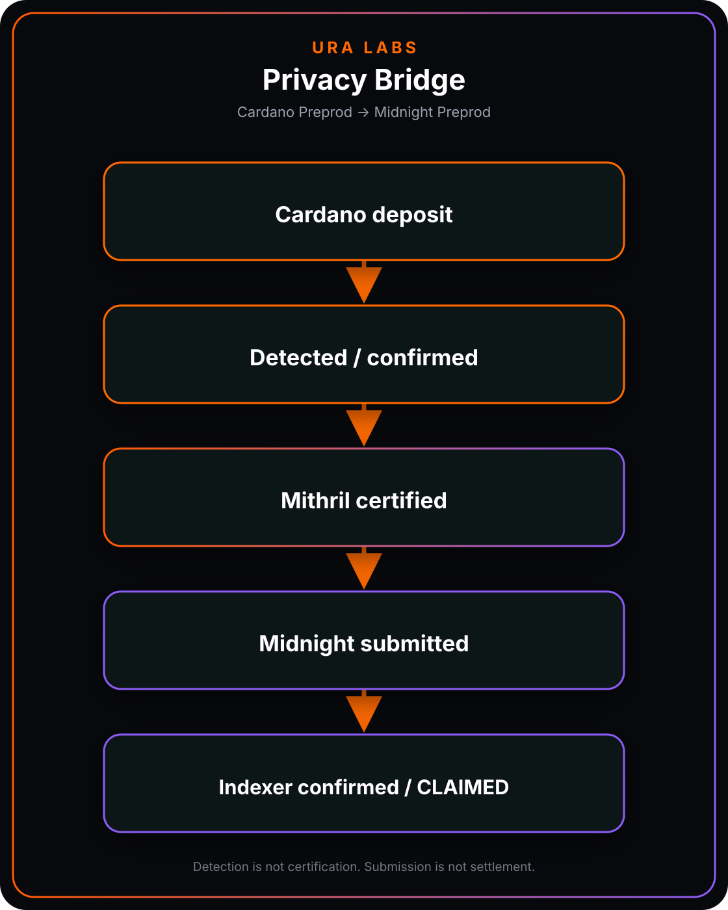
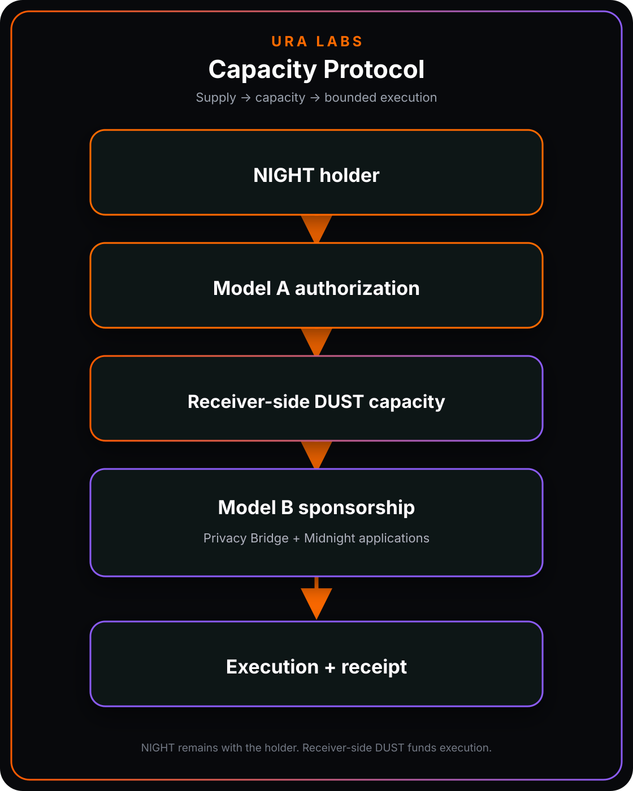

# Ura Protocol

**Mithril-gated privacy onboarding and shared transaction capacity for Midnight**

[Live Preprod](https://preprod.ura.finance) · [Documentation](https://ura-labs-1.gitbook.io/ura-documentation/)

## Overview

Ura combines two systems:

1. **Privacy Bridge** — a strict Cardano-to-Midnight path that separates detection, Mithril certification, Midnight submission and indexer confirmation.
2. **DUST Capacity Protocol** — a hybrid supply-and-execution model that connects future DUST authorization with bounded sponsored application execution.

This repository is Ura's public architecture, status and evidence hub. It does not contain production operator code, wallet secrets or deployment infrastructure.

## System flows

### Privacy Bridge

[How the bridge works](https://ura-labs-1.gitbook.io/ura-documentation/privacy-bridge/how-the-bridge-works)

### Capacity Protocol

[Capacity Protocol documentation](https://ura-labs-1.gitbook.io/ura-documentation/capacity-protocol)

## Public status

| Area | Status | Boundary |
| --- | --- | --- |
| Cardano deposit detection | Demonstrated on Preprod | Detection is not certification |
| Mithril certification gate | Demonstrated on Preprod | A proof must be found and verified before strict submission |
| Midnight submission and confirmation | Demonstrated on Preprod | Submission is separate from indexer-confirmed settlement |
| Model B sponsored execution | Demonstrated on Preprod | Requests remain bounded by operator policy |
| Model A capacity supply | Integration in progress | Generalized holder-wallet signing is not yet proven end to end |
| Production deployment | Not live | Nothing here is an invitation to deposit mainnet funds |

Read the complete [status and claim boundaries](docs/STATUS.md).

## Model boundaries

**Model A — capacity supply**

Selected NIGHT UTXOs authorize future DUST generation to an external receiver while NIGHT remains in the holder's wallet.

**Model B — sponsored execution**

An operator validates bounded requests and spends receiver-side DUST to sponsor approved Midnight execution.

Generated DUST at the designated receiver is controlled by the receiver/operator key. Non-custodial applies to NIGHT, not to generated receiver-side DUST.

## Public documents

- [Architecture](docs/ARCHITECTURE.md)
- [Status and claim boundaries](docs/STATUS.md)
- [Wallet and SDK collaboration request](docs/COLLABORATION.md)
- [Security policy](SECURITY.md)
- [Changelog](CHANGELOG.md)
- [Copyright notice](NOTICE.md)

## Engineering principles

- Proof-gated state transitions
- Explicit custody and authorization boundaries
- Bounded sponsorship policy
- Operator-signed receipts
- On-chain inclusion evidence
- Append-only reconciliation
- No per-coin DUST attribution claims
- No production claims based only on transaction submission

## Current technical priority

Complete one controlled end-to-end Preprod NIGHT redesignation transaction with wallet and SDK engineers: the holder signs an authorization directing future DUST generation to Ura's receiver while NIGHT remains in the holder's wallet.

See the narrow [collaboration request](docs/COLLABORATION.md).

## Repository scope

This is a documentation and evidence repository, not the production monorepo. Ura's application code, warm operator implementation, keys, infrastructure configuration and security-sensitive internals remain private during active development and review.

No licence is granted for the material in this repository unless a file explicitly states otherwise.

© 2026 Ura Labs. All rights reserved.
